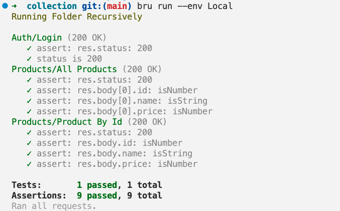

# bruno-cli

With Bruno CLI, you can now run your API collections with ease using simple command line commands.

This makes it easier to test your APIs in different environments, automate your testing process, and integrate your API tests with your continuous integration and deployment workflows.

## Installation
To install the Bruno CLI, use the node package manager of your choice, such as NPM:
```bash
npm install -g @usebruno/cli
```

## Getting started
Navigate to the directory where your API collection resides, and then run:
```bash
bru run
```
This command will run all the requests in your collection. You can also run a single request by specifying its filename:

```bash
bru run request.bru
```

Or run all requests in a folder:
```bash
bru run folder
```

If you need to use an environment, you can specify it with the --env option:
```bash
bru run folder --env Local
```

## Demo


## Support
If you encounter any issues or have any feedback or suggestions, please raise them on our [GitHub repository](https://github.com/usebruno/bruno)

Thank you for using Bruno CLI!


## License
[MIT](license.md)